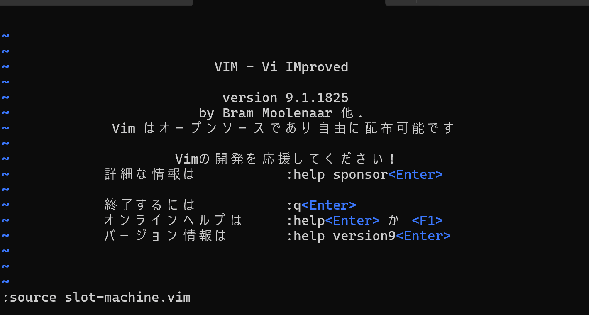

# 🎰 slot-machine.vim


A slot machine that runs on vim.     
Written in Vim script.
## Usage
```
:source slot-machine.vim
```
Loding slot-machine.vim.
```
:SlotMachine 
```
Press the s key to stop the slot machine.

```
:SlotMachine 10 
```
If you want to change the speed of the slot machine, please specify the frame time(ms) as an argument.
